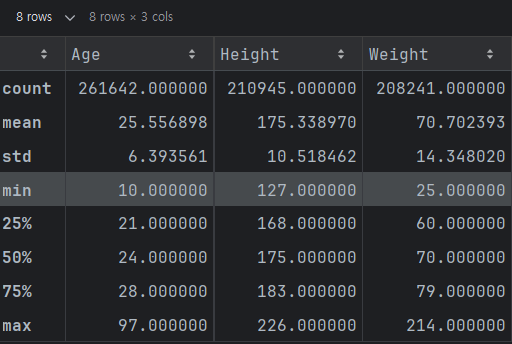
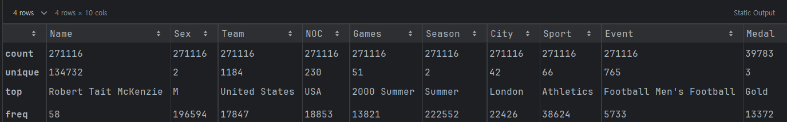
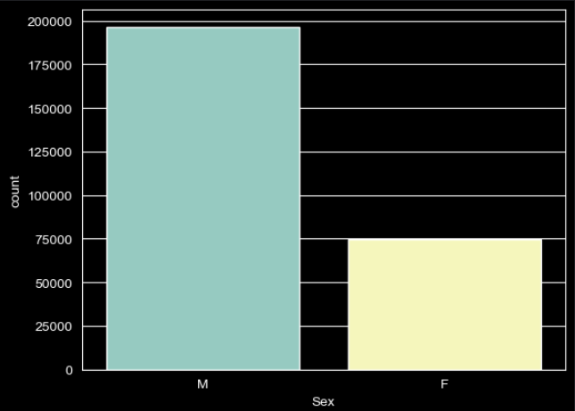

# 🏅 올림픽 개최국 효과(Home Advantage) 데이터 분석

올림픽 개최라는 국가적 이벤트가 실제 메달 획득 성적에 미치는 영향을 데이터로 검증한 EDA 프로젝트입니다.

---

## 1. 📝 프로젝트 개요
* **목적**: 올림픽 개최국의 성적 향상 유무와 지속성, 종목별 편차 분석
* **기간**: 2026.02.23 - 2026.02.24
* **데이터**: 120년간의 올림픽 선수 및 메달 획득 데이터 (`athlete_events.csv`)
* **사용 기술**: Python, Pandas, Matplotlib, Seaborn

---
## 🛠️ 데이터 분석
### 1. 데이터 행/열 수 확인: 
  - 행: 271,116 개
  - 열: 15 개

### 2. 각 변수의 이름, 타입, 결측치 확인:

- **결측치 컬럼:** Age, Height, Weight, Medal

**[ 데이터 구조 ]**

| No | Column | Non-Null Count |  Dtype  | Description |
|:---:|:---|:---:|:-------:|:---|
| 0 | **ID** | 271,116 |  int64  | 선수 고유 식별 번호 |
| 1 | **Name** | 271,116 |   str   | 선수 이름  |
| 2 | **Sex** | 271,116 |   str   | 성별 (M: 남성, F: 여성) |
| 3 | **Age** | 261,642 | float64 | 선수 나이  |
| 4 | **Height** | 210,945 | float64 | 선수 키  |
| 5 | **Weight** | 208,241 | float64 | 선수 몸무게  |
| 6 | **Team** | 271,116 |   str   | 소속 팀 이름 (국가명 또는 혼성팀) |
| 7 | **NOC** | 271,116 |   str   | 국가 올림픽 위원회 코드 (3글자) |
| 8 | **Games** | 271,116 |   str   | 올림픽 개최 연도 및 시즌 |
| 9 | **Year** | 271,116 |  int64  | 개최 연도 |
| 10 | **Season** | 271,116 |   str   | 개최 시즌 (Summer / Winter) |
| 11 | **City** | 271,116 |   str   | 개최 도시 명칭 |
| 12 | **Sport** | 271,116 |   str   | 경기 종목 |
| 13 | **Event** | 271,116 |   str   | 세부 종목 명칭 |
| 14 | **Medal** | 39,783 |   str   | 획득 메달 (Gold, Silver, Bronze) |

### 3. 기술 통계 및 데이터 요약

#### 3-1. 수치형 변수
- **ID 및 Year 제외:** 분석적 의미가 낮은 고유 식별 번호와 연도 데이터는 통계 대상에서 제외하였습니다.
- **Age (나이):** 중앙값이 평균값보다 약간 작게 나타나, 데이터 분포가 오른쪽으로 살짝 쏠려(Right-skewed) 있음을 확인하였습니다.
- **Height & Weight (신체 조건):** 중앙값과 평균값이 거의 일치하여 정규 분포에 가까운 고른 분포를 보이고 있습니다.

#### 3-2. 범주형 변수
- **Name (선수 이름):** 이름의 중복 빈도가 높습니다. 이는 한 선수가 여러 종목에 참여하거나 여러 회차의 올림픽에 출전했음을 나타냅니다. (Full Name 기재 방식으로 동명이인 가능성은 매우 낮음)
- **Sex (성별):** 남성 선수의 수가 여성 선수보다 약 **2.5배** 더 많습니다.
- **Team vs NOC (국적 코드):** 초창기 연합팀 제도 등으로 인해 `Team` 컬럼의 고유값이 `NOC`보다 많습니다. 정확한 국가별 분석을 위해서는 고유 코드인 **NOC** 컬럼을 활용하는 것이 적절합니다.
- **참가 기록:** **2000년 시드니 올림픽**에 가장 많은 선수가 참가하였습니다.
- **Season (시즌):** 하계 올림픽 참가자 수가 동계 올림픽에 비해 압도적으로 많습니다.
- **City (개최 도시):** **런던**에서 총 3회(1908, 1948, 2012)로 가장 많이 개최되었으며, 해당 도시에서는 육상 종목이 가장 활발하게 열렸습니다.
- **Sport (종목):** 전체 참가 선수 기록 중 **남자 축구** 종목의 데이터가 가장 많습니다.
- **Medal (메달):** 금, 은, 동 중 **금메달**의 수여 기록이 가장 빈번하게 나타납니다.

---

### 4. 각 컬럼 세부 정보:

#### 4-1. Name
- 한 선수가 여러 종목을 참가하거나, 여러 해 참가한 것을 추정해볼 수 있다

**[ 주요 선수별 데이터 출현 빈도 ]**

| Athlete Name | Appearances (Count) |
|:---|:---:|
| **Robert Tait McKenzie** | 58 |
| **Heikki Ilmari Savolainen** | 39 |
| **Joseph "Josy" Stoffel** | 38 |
| Ioannis Theofilakis | 36 |
| Takashi Ono | 33 |
| ... | ... |
| Milan Zyka | 1 |
| Olga Igorevna Zyuzkova | 1 |

#### 4-2. Sex

Sex
M    196594
F     74522